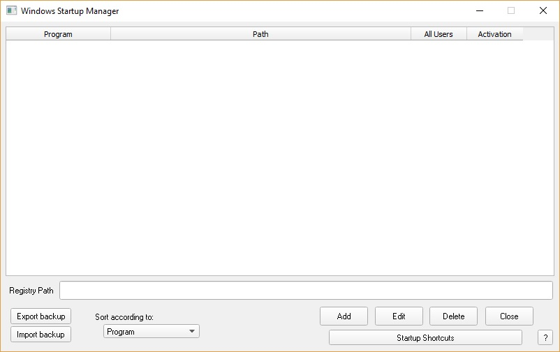
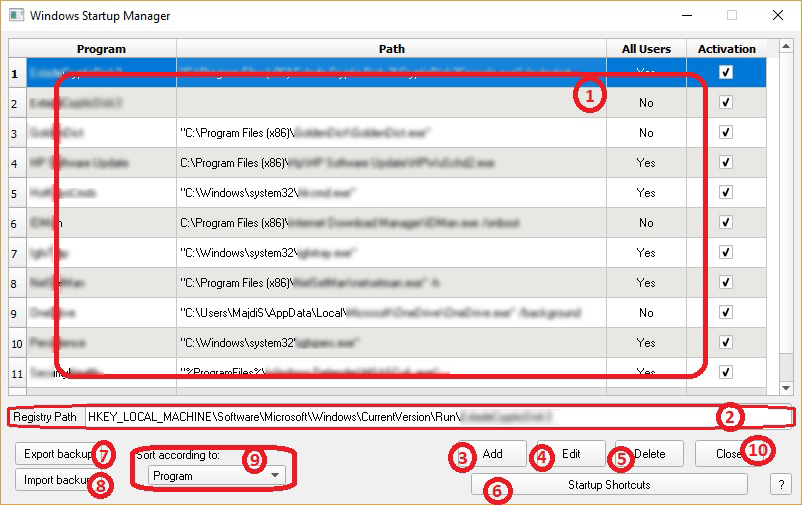

Win Startup Manager
===================

Windows Startup Manager is an application that has the ability to let the user control what programs should start at Windows booting time. It gives you the ability to show, edit, delete, or even add new programs entries to be lunched at Windows booting time.

It is specialized at managing Windows startup entries that are stored in Windows Registry only, but provides a quick option to edit programs shortcuts type entries.

This application has been developed using Ring Programming Language based on RingQt, [Ring_WinCReg](http://ring-wincreg.sf.net/), and [Ring_WINAPI](http://github.com/majdisobain/ring-winapi) extensions.

## How to use

Based on the previous picture, we will learn what is the importance of each item labelled.

1. **Programs entries area**: this is where all programs entries are shown. Here, you can activate\deactivate a program entry or select an entry to be edited\deleted.

2. **Registry path area**: this is where you will see the actual path of the entry in Windows Registry.

3. **Add button**: this will allow you to add new program entry to be lunched at time of Windows booting.

4. **Edit button**: this will allow you to edit currently selected program's entry.

5. **Delete button**: this will allow you to delete currently selected program's entry.

6. **Startup Shortcuts button**: this will open the "Startup" folders in Windows Explorer which will allow you to modify shortcuts by adding(activating) new or deleting(deactivating) already present items from those folders.

	* Note: Windows can run any program that has a shortcut in "Startup" folders at booting time. This "Windows Startup Manager" application has not yet integrated editing shortcuts from within it, so that, this button provides an alternative option to easily reach and modify those shortcuts.

7. **Export Backup button**: this will allow you easily creating a backup of all startup entries to be imported any time.

	* Note: Its highly recommended to have a backup of your programs entries to be imported in case you made unwanted changes.

8. **Import Backup button**: this will allow you to restore previously created backup of Startup entries.

9. **Sorting Options**: this will allow you to sort programs entries according to the selected option.

10. **Close button**: this will close the application.

--------- **ENJOY** :smiley: ----------