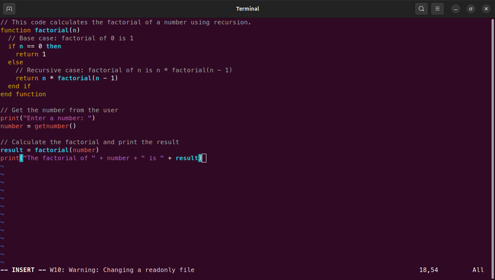

# Ring Syntax Highlighting For Vim Editor 
- Author :[Omar Abderrahmane](https://github.com/Programmer-Om)
- Last update : 30/8/2024

## Installation Guide
### 1 -
- Go to : ~/.vim :
```shell
cd ~/.vim
```
- Create syntax dir :
```shell
mkdir syntax
```
- If ~/.vim doesn't exists :
```shell
mkdir ~/.vim/syntax
```

### 2 -
- Copy ring.vim file to ~/.vim/syntax :
```shell
cp ring.vim ~/.vim/syntax
```
- Then copy filetype.vim to ~/.vim
```shell
cp filetype.vim ~/.vim
```
## And That's All !!

